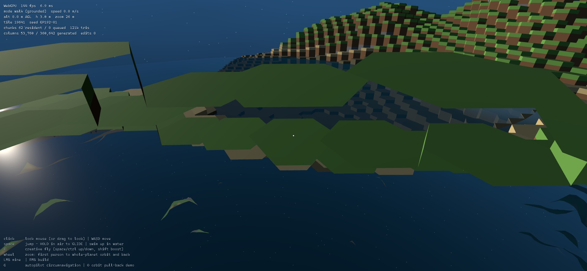
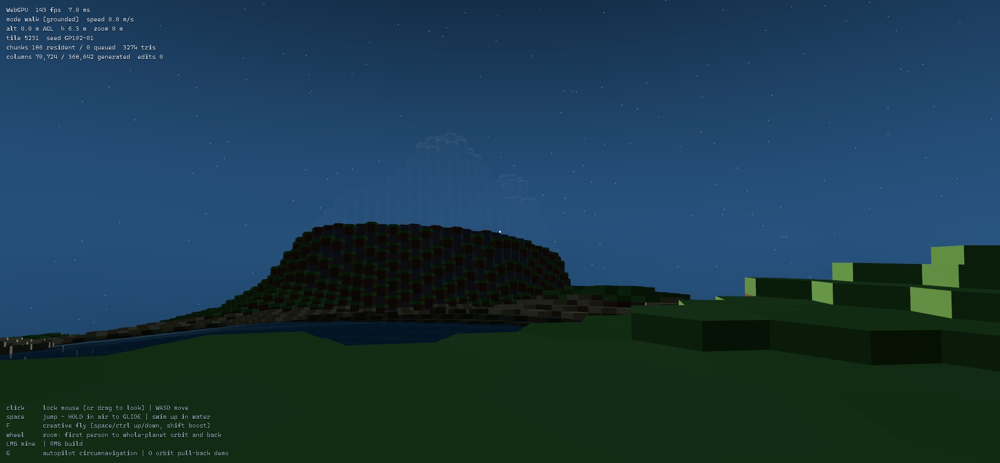

# Goldberg Planet

A browser prototype of a walkable, swimmable, glidable, mineable, buildable spherical planet
whose surface is a true Goldberg polyhedron — hexagons plus exactly twelve pentagons —
continuous from a footstep on a beach to the whole planet hanging in space.

**Play it: <https://matthew-kissinger.github.io/sphere-planet/>**

Best in a WebGPU browser (Chrome/Edge); it falls back to WebGL2 automatically everywhere else.
Jump off a snow peak and hold space.

| | | |
|---|---|---|
|  |  |  |
| the whole planet in frame | a coastline, water depth-tinted | a meshed peak on the night side |

## Run locally

```
npm install
npm run dev      # open the printed URL
npm test         # 22 topology/world/storage/persistence tests
npm run build    # typecheck + production bundle (deployed to Pages by CI)
```

URL params: `?seed=anything` (world seed), `?m=192` (Goldberg frequency), `?gpu=gl` (force the WebGL2 fallback).

## Controls

| Input | Action |
|---|---|
| click | lock mouse — or **drag to look** where pointer lock is unavailable (embedded previews) |
| WASD + mouse | move / look |
| Space | jump — **hold in the air to open the glider**; swim up in water |
| Ctrl or C | descend (creative fly) |
| Shift | sprint / flight boost |
| F | creative free-flight |
| mouse wheel | one continuous axis from first-person to whole-planet orbit and back |
| LMB / RMB | mine / build (click in drag-look mode, hold-to-repeat when locked) |
| G | autopilot: full low-altitude circumnavigation, captures frame metrics |
| O | orbit pull-back demo, captures frame metrics |

Zooming out is radial: the camera rises to sit directly above your location, so your spot on
the planet faces the camera at orbit distance, with screen-up rolling toward your heading.
A capsule character (with a deployable wing) stands in for you whenever the camera is back.

## The world

- **GP(192,0)**: the dual of a frequency-192 geodesic subdivision of an icosahedron,
  projected to a **900 m radius** sphere. **368,642 tiles** (12 pentagons), ~5.2 m across.
- **Oceans, continents, islands, mountain ranges**: a low-frequency continent field splits
  land from sea (~40/45/15 land/ocean/coast); ridged-multifractal ranges climb to **+115 m**;
  ocean floors shelve to **−35 m**; sparse hotspots push volcanic islands through the surface.
  Sea level is a translucent, depth-tinted water sphere with a foam shoreline band and slow
  crossing swells (±18 cm), deep navy over basins and turquoise over shelves.
- **Glider**: hold space while airborne. Nose down trades altitude for speed (up to
  42 m/s), flaring bleeds speed for lift, velocity chases the view so mouse carving banks
  smoothly; it stows on landing, release, or water contact. Jump off a snow peak and ride
  ~9:1 to the coast. Swimming floats you with your head above water; space swims up.

## Shape and identity

- Tile ids are **combinatorial, not spatial**: icosa **vertex** (12), icosa **edge** +
  offset, or icosa **face** + interior (i,j) — an atlas of 20 charts stitched by canonical
  ownership of shared features. No global coordinate chart exists in addressing, which is
  why the twelve pentagons are unremarkable: they're just the degree-5 ids. Neighbor lists
  are explicit and CCW-ordered ([goldberg.ts](src/geo/goldberg.ts)).
- Every tile carries position, boundary polygon, ordered neighbors, and an oriented local
  frame (radial normal + tangents).
- **Watertight by construction**: a shared corner is the normalized centroid of the three
  owning tile centers summed in ascending-id order — bit-identical floats from all sides,
  asserted by test.

## Volume, editing, persistence

- One **global radial layer grid**: 148 uniform 1.25 m cells spanning +130…−55 m around sea
  level, then ×1.5 growth per layer to a single bedrock cell — **163 layers**, so resolution
  decays with depth and storage is O(tiles), never O(R³). Full-planet surface index ≈ 2.2 MB;
  edited columns cost ~64 B each, only when touched. Columns are bitmask runs: tunnels,
  overhangs, and caves work.
- **Edits are permanent and survive residency cycles** — this is verified two ways:
  - unit test: edits replayed over freshly regenerated terrain rebuild a byte-identical mesh;
  - live `persistTest()`: edit, release *every* chunk mesh on the planet, regenerate —
    edit masks untouched, regenerated mesh byte-identical, mined cells still gone, placed
    cells still present. Regeneration is deterministic seed-terrain + edit overlay; there is
    no code path that re-rolls an edited column.
- Picking ray-marches the same column field the mesh is built from; collision reads columns
  too, so physics works even where meshes aren't resident.

## Streaming and rendering

- ~1,800 chunks of ≤ ~256 tiles stream inside an angular cap sized to the *peak-visibility*
  horizon: the eye's horizon for the current altitude **plus** acos(R/(R+H_max)) ≈ 0.48 rad,
  so every mountain silhouette you can see is fully meshed — the far sphere only ever draws
  beyond what terrain can occlude (capped at 0.88 rad ≈ 790 m arc). Hysteresis plus a
  4.5 ms/frame build budget; releasing frees mesh memory only.
- The **far view** is a frequency-96 geodesic mesh (~92k verts) sampling the same terrain
  field, sunk 6 m, always resident; triangles fully covered by resident chunks are filtered
  from its index. The horizon silhouette is a ~550-segment circle. The water sphere and TSL
  fresnel atmosphere are always resident too — pulling back to orbit never streams.
- **Floating origin**: f64 simulation, camera pinned at (0,0,0), per-frame `anchor − eye`
  subtraction in f64. No jitter at any distance; planet-centric coordinates are bounded by
  construction.
- **WebGPU first** via `three/webgpu` (r185); automatic WebGL2 fallback (`?gpu=gl` to force).
- Gravity pulls toward the core; "up" is the local radial normal; heading is a
  parallel-transported tangent — no poles, no gimbal, pentagons included.

## Measured (RTX 3070, 1080p @ 145 Hz, Chromium, GP(192,0) / R=900)

| Measurement | Result |
|---|---|
| Topology build (368,642 tiles, ids + CCW neighbors) | 165–283 ms |
| Far sphere build (92k verts, 184k tris, sliced) | ~240 ms |
| **Traversal**: full circumnavigation (5.65 km at 110 m/s, 55 s) | **144.0 fps avg** (display-locked), p50 6.9 / p95 7.1 / p99 7.8 ms, max 21.1 ms, **0 frames > 33 ms** |
| Streaming during that lap | 1,499 loads / 1,330 releases; ~315–400 resident (≈20% of planet), ~600k tris |
| **Orbit round-trip** (ground → whole planet → ground) | 144.0 fps avg, p99 7.1 ms, max 11.7 ms |
| **Glide** (74 m peak, 347 m flight, 19 s) | 144.0 fps avg, p99 7.1 ms, 63 loads / 42 releases under the flight path |
| Mine/place incl. localized chunk rebuilds | avg 2.3 ms, max 3.3 ms per edit |
| Edit persistence (release all → regenerate) | mask + mesh byte-identical, verified live |
| Buoyancy | settles at 1.37 m submerged (head above water) |
| Chunk mesh build | avg 1.06 ms, p95 1.8 ms, max 3.4 ms |
| WebGL2 fallback | matches WebGPU when warm (p99 ~9 ms); one-time ~1.3 s shader-compile stall on first visibility |

Test suite: 22 tests — icosahedron invariants; 10m²+2 counts with exactly 12 pentagons;
neighbor symmetry; CCW winding and bit-identical shared corners; id round-trips; seam
agreement; `tileOf` vs brute force; layer-grid inverses; terrain determinism and
ocean/land/mountain balance; column edit semantics incl. tunnels and immutable bedrock;
sparse-edit storage scaling; chunk partition exactness; mesh determinism; edit locality;
**edit persistence through regeneration**.

## Honest limitations

- Edits don't re-render into the far-view proxy or the orbit view (sub-pixel at that
  distance); a megastructure won't show from space until approached.
- Beach tiles step ~0.35 m above the water plane; at grazing angles distant waterlines can
  glint. The far sphere sits 6 m low; partially-covered coastal triangles at the residency
  boundary can peek through the sea surface far away.
- Collision is a column-sampled point capsule (step-up, head bump, wall block) — fine at
  these speeds, not a swept hull.
- Meshing stays on the main thread because measurement says it can (p95 1.8 ms); the mesher
  is three-free and typed-array pure, ready to move to a Worker if a bigger planet needs it.
- Edits persist for the session (Map keyed by tile id); there is no save file yet.
