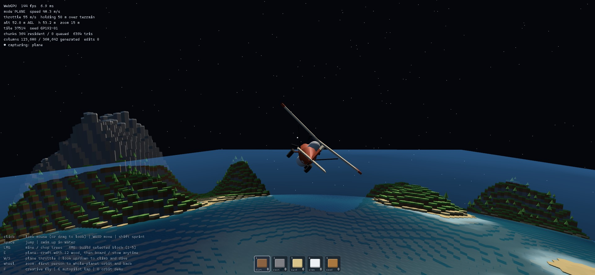
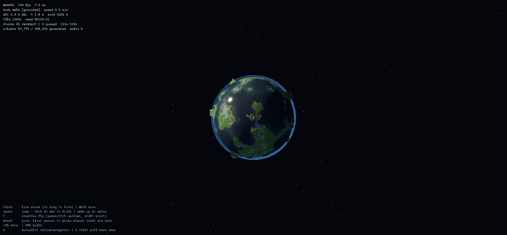

# Goldberg Planet

A browser prototype of a walkable, swimmable, flyable, mineable, buildable spherical planet
whose surface is a true Goldberg polyhedron — hexagons plus exactly twelve pentagons —
continuous from a footstep on a beach to the whole planet hanging in space.

**Play it: <https://matthew-kissinger.github.io/goldberg-planet/>**

Best in a WebGPU browser (Chrome/Edge); it falls back to WebGL2 automatically everywhere else.
Works on phones too — touch controls appear automatically — and standard gamepads can drive
the full survival loop. The game is a sandbox: walk, swim, mine, build, chop two trees for
plane wood, then press `E`, tap the plane button, or press gamepad Start to fly around the
world, under, over, and through the voxel clouds.

| | | |
|---|---|---|
|  |  |  |
| the wooden plane you craft | forests grow from the same seed | the whole planet in frame |

## Run locally

```
npm install
npm run dev      # open the printed URL
npm test         # topology/world/trees/storage/save/persistence tests
npm run build    # typecheck + production bundle (deployed to Pages by CI)
```

URL params: `?seed=anything` (world seed), `?m=192` (Goldberg frequency), `?gpu=gl`
(force the WebGL2 fallback), `?creative=1` (999 of every block, the plane unlocked, and
free-flight enabled), `?touch=1` (force the touch UI), `?clouds=0` (no cloud layer),
`?skyq=low|high` (sky march quality; defaults low on coarse-pointer devices), `?debug=1`
(start with F3 diagnostics open), `?nosave=1` (disable local save writes), `?resetSave=1`
(clear the current seed/frequency save slot before boot), `?mute=1` (start with game audio
muted).

## Controls

| Input | Action |
|---|---|
| click | lock mouse — or **drag to look** where pointer lock is unavailable (embedded previews) |
| WASD + mouse | move / look |
| Space | jump; swim up in water |
| Shift | sprint / flight boost |
| LMB | mine terrain / **chop trees** (+6 wood each) |
| RMB | build the selected block |
| 1–5 | hotbar: dirt · rock · sand · snow · wood — mining feeds the counts, building spends them |
| **Q** | eat the best packed food to restore stamina and reduce exposure |
| **B** | open crafting plus the Pack Ledger inventory readout: sticks, workbench, stone tools, stone blade, reed bow, whistling arrows, fishing rod, bait, campfire, chest, bedroll, crop plot, compost bin, rain cistern, root cellar, shelter kits, dock segment, fish trap, shore net, drying rack, weather vane, lantern, waystone, plane frame |
| set button in crafting + RMB | place crafted camp/house props on the highlighted hex |
| **Z / X** | rotate the selected crafted prop before placing it, or rotate a nearby placed prop by one hex face |
| **R** | use a nearby placed prop: open chest storage, tend/harvest/fertilize/irrigate crop plots, turn scraps into compost at compost bins, catch rain at rain cisterns, cache or pull provisions at root cellars, cook at lit campfires, set/check/collect fish traps, set/check/comb shore nets, preserve food at drying racks, read weather vanes, light campfires/lanterns, set bedroll home/rest, cast from dock segments, or attune waystones; with no nearby prop, discover pentagon landmarks, gather active Skyfall craters, listen to active World Murmurs, read completed season afterglows, cast from shore with a fishing rod, or forage the current terrain |
| **Shift+R** | pack a nearby empty/inactive placed prop back into inventory; stocked, lit, planted, home, attuned, anchored, or set trap props must be cleared first |
| **V** / **Shift+E** | grab a nearby inactive placed prop into the relocation cursor, rotate it with `Z/X`, then drop it on a valid snap hex |
| **M** | open the Route Slate: Hearth Beacon home signal, active Skyfall events, active World Murmurs, completed season afterglows, nearby cave/ecology pins, and after the first pentagon awakens, Horizon Chart target distance, turn direction, and expedition prep |
| **P** / **Shift+P** | pin the current Route Slate candidates as a saved route itinerary, or append a new distinct stop / clear the itinerary; while the Route Slate is open, Arrow Right moves the active stop later and Arrow Left drops the active stop |
| **J** | open the Hearth Journal: home state, route prep, discoveries, cave/food/ecology notes, and current next goals |
| **N** | mute / unmute generated ambience and interaction audio |
| **E** | **the plane**: chop 2 trees for 12 wood, craft it once, then board / stow anytime |
| W / S (flying) | throttle 16–88 m/s |
| look up / down (flying) | climb / dive — **level flight holds your height over the terrain** |
| mouse wheel | one continuous axis from first-person to whole-planet orbit and back |
| F | free-flight / walk toggle |
| F3 / H | diagnostics overlay / show the help again |
| G / O | autopilot circumnavigation / orbit pull-back demo (both capture frame metrics) |

**On touch devices** the UI switches itself over: a floating joystick on the left moves
(push past the rim to sprint — in the plane it works the throttle), dragging anywhere else
looks, **tap to mine or chop**, **hold ~0.4 s to build** (keep holding and drag to paint),
pinch to zoom from first person to orbit, and round buttons handle jump/climb, descend,
nearby prop use, nearby prop move/drop, crafting/Pack Ledger, Route Slate open plus panel buttons for pin/later/drop/clear, and boarding / stowing the plane. With `?creative=1`, the plane
button toggles walk/free-flight so mobile has the same Creative shortcut as desktop `F`.
Long-press the touch `use` button to pack a nearby safe prop, matching `Shift+R` on keyboard.

**With a standard gamepad** the UI switches labels and layout state after the first controller
input: left stick moves, right stick looks, full stick/RB sprints, LB+right stick zooms,
`A` jumps/swims up, `LT` descends, `X` mines/chops, `RT` builds, D-pad left/right cycles the
hotbar, `B` uses or closes the open panel, `LB+B` packs a safe prop, `Y` toggles crafting,
`LB+RT` grabs or drops a movable prop, Back opens the Route Slate, D-pad left/right inside the slate drops or moves the active itinerary stop later, `LB+D-pad` rotates selected build pieces or the active move cursor before placement, and Start boards/stows the
plane. `LB+Back` toggles mute. While crafting or chest storage is open, D-pad moves the focused row/action, `A`
confirms craft/place/transfer, and `B` closes the focused panel without leaking jump, use,
hotbar, mine, or build input into the world. Automated gamepad proof uses injected
synthetic controller input; physical controller validation remains manual and unclaimed.

## The survival loop

Trees grow in forest clusters on grassland — deterministically from the seed, like everything
else: a released region regrows the same woods, minus what you chopped (the chopped set is
sparse state, independent of mesh residency, exactly like column edits). Trees now take
staged hits: each chop cracks and shakes the tree, the final hit fells it, and six wood
lands as short-lived grounded pickups before it enters your pack. Two felled trees still
craft your plane. Mining now follows that same staged reward rule: dirt, sand, snow, wood,
and rock cells darken with cracked facets over repeated hits, matching shovels/picks/echo
tools shorten the sequence, and only the final pop spawns a bouncing chip. Cave-adjacent
rock can loosen glow-crystal chips the same way. Ready pickups now also trigger a short
avatar bend-and-catch handoff that shows the collected item prop, so wood, cave crystals,
fish, compost, and creature gifts feel like physical finds instead of only HUD text.
Mined material still follows the terrain
rules (grass crumbles to dirt, seabed to sand); the hotbar builds it back anywhere, and placed cells **remember
their material** through release and regeneration. Press `B` to open the first Hearth and
Horizon crafting panel and Pack Ledger: carried hotbar materials and crafted items are grouped
as materials, tools/light, food/bait, build kits, route gear, and parts, with meal-unit totals,
tool-wear details, and pack-burden load available on keyboard, touch, and gamepad through the
same panel. Burden is a soft travel pressure, not a hard cap: heavy loads drain more stamina
while moving, overloaded packs block sprint until you stash materials or build storage, and
Creative mode ignores burden. A workbench-crafted Pack Frame made from wood, sticks, and
reeds fits a visible back frame, adds +28 pack capacity, and helps turn borderline heavy
loads back into field carry without removing burden entirely. A workbench-crafted Storm
Cloak made from snow, reeds, kelp, and snow herbs fits a visible shoulder cloak, softens
storm/rain/cold/soaked exposure while you are outside, and counts as storm-route prep
without replacing shelter or weather vanes. Wood and rock become sticks, a workbench, stone tools, echo tool upgrades, camp gear,
shelter kits, fishing rod, dock segments, fish traps, compost bins, rain cisterns, root cellars, cave anchors, drying racks,
weather vanes, waystones, field repair kits, pack frames, storm cloaks, a compact Stone
Hatchet, a Stone Blade, a Reed Bow with whistling arrows, and a visible plane-frame recipe. Crafted camp and house props
can be selected with their `set` button and placed on the spherical hex world; placed
workbenches count as crafting stations even after they leave inventory. Build placement now
has an explicit facing contract: `Z/X` rotate the selected prop or nearby placed prop one
hex face at a time, gamepad `LB+D-pad` rotates selected build pieces, and inactive placed
props can now be moved through the relocation cursor with `V`/`Shift+E`, the touch move
button, or gamepad `LB+RT`. The C1 and C2/C3 browser proofs verify rotated placement, safe
pack-back, lit-prop pack refusal, snap-preview and blocked-preview diagnostics/screenshots,
snap-grid relocation blockers, and state-preserving snap-back across desktop, laptop,
tablet, phone, and injected synthetic gamepad profiles. Stone axe, pick,
shovel, and hatchet now matter in play: matching tools reach a little farther, repeat
faster while held, and track saved wear. The Stone Hatchet is a short-reach, quick,
fragile one-handed chopping and brambleback-warding sidearm that sits below the full stone
axe and echo axe. The Stone Blade is the first close-control defensive tool: it crafts at
the workbench from sticks, rock, and reeds, shows on the avatar and Pack Ledger, wears like
other tools, and wards bramblebacks without increasing mining or building reach. The Reed
Bow is the first ranged native-hazard control tool: whistling arrows spend one reed-fletched
shot, scare bramblebacks before they crowd you, wear the bow through the same repair system,
and leave grounded reed rewards instead of creating a kill-for-loot loop. Workbench repair kits made from sticks, rock, and reeds
automatically save a matching stone tool at the break point, spend one kit, and leave a
clear HUD/tool readback on keyboard, touch, or gamepad. Glow crystals, repair kits, and the
base stone tools can now upgrade into echo axe, echo
pick, and echo shovel variants that reach farther, repeat faster, last longer, satisfy the
same expedition prep/site-work contracts, and show as crystal-accented hand/back props.
Placed props now
have first utility state: crop plots plant/tend/harvest berry food, accept compost
fertility, spend stored rain-cistern water, and now care about nearby water,
daylight/window/lantern light, cold, storm exposure, and shelter protection; compost bins
turn kelp, berries, cave mushrooms, or raw fish scraps into compost that speeds growth and
can boost fertile harvests; rain cisterns catch mist, rain, or storm water so inland gardens
can grow away from shore; berries craft into bait,
lit campfires cook raw fish into cooked fish and fish-and-berry camp meals, drying racks
preserve raw fish with kelp, reeds, or snow herbs into trail rations, and lit campfires can now turn
camp meals, trail rations, and cave mushrooms or snow herbs into expedition stew; lanterns toggle
lit, bedrolls mark the home/rest point, chests open a material storage panel with
per-resource stash/take controls,
shore reeds now add a second crop shape: waterline forage can cut reeds, crop plots beside
natural water can plant reed slips, reed beds tolerate harsh shore weather, harvest reeds
and bait scraps, and reeds can compost, wrap fish on drying racks, or craft a lighter reed
fish trap; fish traps can be placed at shore, dock, or sea-cave water, optionally spend bait when set,
persist their soak timer in save state, and later haul raw fish back into the food loop;
shore nets now give reed camps a faster passive fishing chore: craft a reed-and-stick net,
set it at shore, dock, or sea-cave water, comb it after a short soak, and haul raw fish plus
waterline scraps like bait, reeds, or kelp from the same local fish-school ecology;
root cellars cache trail rations, camp meals, or cave forage as saved home provisions that
Route Slate counts for expedition prep; using a stocked functional home bedroll now serves
a hearth supper after dawn rest, spends one cellar provision, and grants trail focus for the
next trip; dock
segments snap to shore/water edges as visible plank-and-piling platforms, and
weather vanes read local wind and storm timing for route prep. Cave anchors record a nearby
arch, dry cave, or sea cave mouth as a saved expedition target, while waystones
persistently mark home, cave, shore, forage, or survey points for future routes. `Shift+R`
packs empty, inactive props back into inventory, while active or stocked utility props ask
you to clear their state first.
With a fishing rod, `R` casts from shore when no nearby prop is in reach, or from a nearby
dock segment for stronger dockside runs. Fish schools now move with tile, time, weather,
docks, and cave water: quiet water can be baited, storms create stronger runs, docks steady
local catches, and sea caves can produce richer catches. Sea-cave fishing now has native
risk too: Tide Lurkers hide around actual sea-cave mouths, a successful cave cast can stir
one into a stamina/exposure surge, and lanterns, an echo lantern, a Stone Blade,
hatchet/axe, or whistling arrow can startle it once so raw-fish pickups scatter onto the
ground. Fish traps and shore nets turn those same shore,
dock, storm, and sea-cave readings into a return-later camp chore with Route Slate, Hearth
Journal, F3, `__world.structures()`, and `render_game_to_text` readbacks. When fishing is not available, `R`
can forage the land itself: berry patches on mild ground, snow herbs on cold ridges, kelp
near water, and cave mushrooms or sea-cave kelp underground. The twelve pentagons now have first
pass landmark shrines; stand on or beside one and press `R` to awaken it, reveal its clue,
persist the discovery, unlock the Horizon Chart on the first new awakening, and gain that
pentagon's named insight plus a themed practical reward. Each pentagon also projects a local
domain: warm-ring ground, salt-tide shore, root-vault hollow, snow-dial slope, deep-bell
stone, and other signatures now show as colored shrine halos, F3/readback state, Route Slate
pins, small ecology/weather shifts, and three local resource sites per pentagon. The first
landscape-geometry pass gives those domains visible approach terrain too: aprons, ribs,
spires, fins, knuckles, scree, steps, reeds, bells, and horizon vanes make each pentagon read
as a different expedition site before it becomes a UI label. Those landforms now also carry
derived expedition-site contracts: repeat landmark reads, Route Slate, Hearth Journal,
F3, and `render_game_to_text` can call out what the site wants from the player, such as
building a dock-and-rack camp, weather-vane blind, root shelter, cave-reading station,
cistern line, or long-route waystone gate. Those contracts now check the actual nearby
structures and carried kit, become ready once the site is prepared, complete through a
repeat landmark read, pay a one-time site reward, and save with the world. Each site also
has a sealed/open threshold landform — hearth arch, rain pocket, tide underpass, lantern
skylight, root room, scree gate, snow terrace, storm pocket, reed spring mouth, deep-bell
chamber, horizon gate, and more — with visible renderer meshes plus Route Slate, Journal,
F3, and debug readbacks that open after site completion. Opened thresholds also have first
local effects: homeward warmth softens survival pressure, weather pockets time storms,
tide and spring thresholds pull fish runs, root and snow thresholds improve forage, and cave
thresholds reduce dark-cave pressure. Completing a site also carves a small save-backed
terrain mouth, pocket, shelf, hollow, or gate near the opened threshold, so the strongest
pentagon sites start changing the actual traversable land instead of only adding readback
and buffs. Step into an opened threshold and `R` can now read its first chamber memory once:
hearth alcoves, rain hollows, tide crawls, lantern shafts, root pockets, scree notches,
snow shelves, glass ledges, storm seats, spring seeps, bell throats, and horizon slots give
a strange note, a small practical reward, a Route Slate pin, and saved Hearth Journal
progress. Soft-Facet moss-puffs now graze grassy forest-edge hexes as the first harmless
native life: walk close and press `R` to gently brush one, save that tended state, and let
berry-seed pickups bounce onto the ground before they enter your pack. Shell-skitters now
scuttle along shore sand as a second harmless neighbor: coax one gently to save the encounter
and drop bait scraps or tideline kelp for fishing camps. Reedback grazers now shuffle along
wet grass near natural water as a farming helper: scratch one gently, save the encounter,
and let compost pellets drop into the world for crop fertility. Cave Blinkers now blink
around real cave-mouth columns as harmless cave helpers: match their rhythm once, save the
encounter, gain a short cave-focus breath, surface blink-focus cave-pressure readback, and
drop blinkcap cave mushrooms as grounded pickups. Bramblebacks now
claim some open grass and snow ridges as the first territorial native hazard: crowding one
rattles stamina and exposure, while using `R` with an axe, lantern, echo lantern, or storm
cloak wards it and drops thorn-reed pickups; the Stone Hatchet counts as the first compact
axe-prep answer for that warding loop, and the Stone Blade now reads as the first dedicated
close-control defense answer without adding a generic weapon loop. Cave bell-jaws now
guard real dry and sea-cave mouth columns as a second territorial hazard: crowding one
claps stamina/exposure, while lantern light, an echo lantern, or a Stone Blade folds it back
into the cave seam and drops glow-crystal shards as grounded pickups. Storm burrs now
roll across open grass and snow ridges as a weather-bound native hazard: they stay readable
in calm weather, but only auto-pressure during storm, rain, cold, or soaked weather; a Storm
Cloak brace, Stone Blade, hatchet/axe, or whistling arrow grounds one once and drops
wind-burr reed fibers as grounded pickups. Tide Lurkers now
wait near sea-cave fish shimmer as a cave-fishing hazard: their eye bulbs rise before the
snap, successful cave casts can wake them, and steady light, blade/hatchet/axe, or a
whistling arrow startles them below the tide while raw-fish drops bounce into the world.
Scree-snappers now
hide on rocky cave-route scree as the first combat-capable native loop: mining rock nearby
can wake a snap, the creature telegraphs with lifting jaw plates, and a Stone Blade,
hatchet/axe, or whistling arrow stuns it once so it flees under scree and drops rock shard
pickups. Native hazard counters now also drive readable Wayfarer action beats: unprepared
pressure staggers the character, close counters use a guarded ward, Storm Cloak counters
brace, and reed-bow counters read as a shot. Nearby native hazards and untended helpers now
surface in Route Slate and the
Hearth Journal too: the route panel can call out a creature's direction, telegraph, answer,
and grounded reward, while the journal tracks visible/tended/warded native life as field
work instead of hiding it in diagnostics. Native encounters can also own the route ribbon:
an unresolved nearby hazard can pull the guide off a distant seasonal route, and `P` can pin
that single creature stop as a saved native route plan. The Reed Bow and
whistling arrows add the first ranged version of that same idea: scare a visible brambleback
off before it crowds the player, spend ammo, and keep rewards grounded in the world. Dormant reeds, shells, pods, crystals, blooms,
amber, and horizon shards become harvestable after the matching shrine awakens, grant
practical survival/building items once, save with the world, and appear as Route Slate
resource pins when nearby. Skyfall events now give the
    planet a moving timed opportunity: each day window drops one visible emberfall,
    glass-rain, or starbloom impact site somewhere on the sphere with a named high sky omen,
    Route Slate and the Hearth Journal call out the sky cue before it cools, the route ribbon
    can guide the trip, and `R` gathers the crater once for useful crystal, sand, or seed
    rewards that save with the world. World Murmurs are the
    first observation-only wonder events: each day window places wind-thread, tide-bell,
    root-whisper, cave-breath, or star-glass signals on the sphere, Route Slate and the
    route ribbon can point toward an active one, and `R` listens close-up to save the note
    without turning every mystery into loot. The first Stranger Season forecast now folds
    those timed systems together: Route Slate, the Hearth Journal, F3, and browser readback
    name the current and upcoming Skyfall/Murmur overlap windows, call out whether the trip
    is a split choice, fall chase, listening walk, or quiet travel/rest window, and explain
    the reward-vs-note tradeoff before you commit a route line. Claiming a fall and listening
    to at least one overlapping Murmur now links the season chain; listening to all three
    notes turns it into a full season chord, both surfaced in Route Slate, Hearth Journal,
    F3, and save-backed readback through the already-persistent fall/note histories. Linked
    season chains now count as route memory in expedition prep, and a full season chord can
    trim one long-route food burden when no matching food insight already does. Pressing
    `P` during an active Stranger Season can now pin a dedicated seasonal itinerary that
    chains the active fall and remaining unobserved notes through the same saved route line,
    route ribbon, atlas overlay, and Hearth Journal surfaces as other planned trips. Those
    seasonal stops advance when the player actually gathers the fall or listens to the note,
    so the route line tracks completed season actions rather than mere arrival. Completing
    the whole seasonal itinerary grants season chord focus, a long trail-focus window that
    makes the next expedition easier to carry through. A completed full season chord now
    leaves a low season-afterglow marker at the fall crater; Route Slate, the route ribbon,
    Hearth Journal, F3, save/export/import, and `render_game_to_text` expose it until the
    player reads it for a one-time focus, stamina, and exposure-relief boon.
    Insights are not just lore:
The first audio pass is now live: a generated planet-wind ambience loop starts after the
first player gesture, generated SFX mark crafting, build placement, gathering, fishing,
campfire/rest, cave reading, water catching, pentagon awakening, Skyfall harvesting, Route
Slate use, and UI confirm/deny feedback, and the streamed Twelve Bells album drifts in with
long gaps like planetary weather. Press `N` to mute/unmute, or use `?mute=1` for silent test
sessions; F3 and `window.__world.audio()` expose unlock/load/mute/event/music diagnostics.
Hearth, tide, root, stone, cave, and storm readings can lower specific expedition burdens
for food, shelter confidence, tool readiness, cave light, or storm timing. Press `M`
afterward to read the
nearest unknown pentagon, distance around the sphere, and relative turn direction, plus a
compact expedition-readiness checklist for food, rest, home shelter, tools, light, and plane
travel. A read weather vane in the home cluster can satisfy storm-timing prep before a
departure, and stocked root-cellar provisions count toward packed-food readiness. `M` now opens a compact Route Slate that ranks the chart target, Hearth Beacon,
nearby domain/resource, active Skyfall, active World Murmurs, nearby cave signal, anchored cave targets, active pentagon insights, attuned waystones, storm pressure,
fish runs, and forage opportunities as route pins; the best remote route target also gets a
short terrain-hugging ribbon of dashes in the world. Pull the camera toward orbit and that
same route becomes a high-altitude atlas overlay with bright arc dashes plus origin and
destination halos, so the planet itself reads as the map instead of only a local compass.
Press `P` to pin the current route candidates into a saved itinerary: the first stop becomes
the Route Slate primary, owns the route ribbon, and advances to the next saved stop when
reached. Ready route-adjacent fish traps and shore nets can cover part of a long route's
packed-food burden, and when that saved Horizon Chart route is reached the eligible staged
sources are checked and cleared while off-route gear stays ready. Pressing `P` again can
append a new distinct stop, `Shift+P` clears the itinerary, and the whole line survives
save/export/import and appears in the Hearth Journal so a trip can be resumed after detours. `J` opens the Hearth Journal, a
persistent in-game memory surface that gathers home quality, survival pressure, packed food,
garden state, Route Slate prep, pentagon progress, domain resources, Skyfall, World Murmurs,
caves, fish, and forage into short next-goal notes. If you have set a home bedroll, the Hearth Beacon reads home direction even
before the chart exists: a lit local campfire turns home into a smoke signal with a
great-circle distance and local turn direction. Survival progress now writes to a local Hearth and Horizon save slot per
seed/frequency: player position, hotbar inventory, crafted/food/travel items, stamina,
exposure, weather/time state, placed props and their utility state, pentagon discoveries,
domain resource and Skyfall harvests, World Murmur observations, season-afterglow readings, threshold chamber readings,
cave-resonance observations, the saved route itinerary,
plane unlock, column edits, and chopped trees restore after reload
unless `?nosave=1` is used.

Expeditions now have a light pressure layer. Local weather shifts as time passes, sprinting
and swimming spend stamina, storms/cold/soaking raise exposure, and full shelters with warmth
recover both quickly. Press `Q` to eat the best packed food; expedition stews, camp meals, trail rations,
cooked fish, and berries turn farming/fishing/cooking into practical cave and flight prep
rather than a side counter. Expedition stew adds timed trail focus, reducing cave, weather,
and long-flight pressure while it lasts and surfacing in Route Slate and Hearth Journal
readbacks. A fitted Storm Cloak reduces hazardous weather exposure in the same survival
loop, but full recovery still comes from warmth, shelter, food, and good timing. Using a home bedroll now sleeps to dawn, advances saved weather/time, and restores
more stamina/exposure when the bedroll is inside a weather-safe or fully functional shelter;
if that functional home also has root-cellar provisions, the dawn rest serves a hearth
supper that spends one provision and adds timed trail focus for departure.
Maximum exposure now triggers the first collapse-recovery consequence: the player wakes at a
marked home bedroll when one exists, or at spawn if no home has been claimed, with complete
shelter giving the strongest recovery and the Hearth Journal counting rescues. Weather
vanes now do more than forecast: when placed within the wider home instrument ring, using one
from a weather-safe shelter during storm, rain, cold, or soaked conditions can wait for a
safer weather window, advance the saved clock/weather, recover stamina/exposure, and write a
short weather-watch note into the Hearth Journal.

Natural terrain also has its first cave pass: a deterministic near-surface void field carves
some shallow land arches, dry caves above sea level, and shoreline sea caves. These are real
column voids used by collision and meshing, so they create actual ceilings, floors, and
walls rather than decorative cave markers. The first cave-mouth visibility pass makes nearby
generated arches, dry caves, and sea caves surface as readable route targets: arches keep
stone ribs, while dry and sea caves use low stone lips, cairns, and glow tags; Route Slate
cave pins report depth/clearance/
flooded state, the route ribbon can point to off-tile mouths, and the echo lantern reads the
same mouth signal with `R`. A crafted cave anchor can now be placed near one of those mouths
and set with `R`, saving the cave kind, depth, clearance, flooded state, and route-ribbon
target as a persistent expedition marker. Some dry caves now carry sealed freshwater spring
seeps that are not sea-flooded: spring cave mouths get a small blue world marker, Route
Slate/echo-lantern/cave-anchor readbacks call out the seep, and nearby rain cisterns can
tap clear-weather water for inland cave camps and gardens. Mining rock beside dry or
sea-cave voids can now yield glow
crystals, which upgrade a crafted lantern into an echo lantern for cave resonance. Caves now
add a real pressure layer: dark dry caves and sea caves raise exposure and slow stamina
recovery until you bring a lantern, echo lantern, or warmth. Once you are inside a real dry
or sea cave, the echo lantern can also read a one-time chamber resonance, record it in the
Hearth Journal, and pay a small glow-crystal reward.

The player avatar has its first Hearth and Horizon equipment pass and its first named art
direction: **Soft-Facet Wayfarer**. Pull the camera back and the procedural fallback model
now uses sampled SDF blend-shell body and limb meshes, faceted normals, shader breathing,
squash-and-stretch action beats, a hood rim, scarf, rounded pack, bedroll, satchel, boots,
mittens, selected blocks or build kits in hand, crafted tools on the backpack, and short poses
for walking, sprinting, jumping, swimming, plane mode, chopping, mining, building, crafting,
fishing, farming, cooking, preserving, resting, pickup handoffs, native-defense beats, and
pentagon discovery. Workbench, campfire, chest, bedroll, waystone, and plane-frame carries now
have specific silhouettes instead of the generic pack fallback, and plane mode includes a
named seated pilot/yoke silhouette. `Character.stats()`, F3, browser diagnostics, and
`render_game_to_text` expose the avatar's named readability parts, prop sockets, held/stowed
props, and action coverage; `npm run proof:character` captures desktop, laptop, tablet,
phone, gamepad, and WebGL fallback screenshots. This is the runtime contract for the future
authored player model and prop set. Root-cellar kits and provision crates now join the visible
cache/withdraw poses. Cave-anchor kits, rope coils, and the cave-reading pose now join the
expedition prop set. Drying-rack kits, trail ration bundles, and expedition stew bowls or
packed pots are now part of that visible prop contract, alongside compost sacks,
compost-bin kits, rain-cistern water jars, pack frames, storm cloaks, weather-vane kits, and
the cooking, eating, spring-tapping, composting, fertilizing, irrigating, forecast-reading,
weather-bracing, and hood-pull poses. The cycle docs now treat the authored character model,
equippable props, socket map, and animation packet as a formal deliverable for every survival
slice, including collapse, bedroll wake-up, spawn-rescue, route-planning, and pentagon
landmark approach poses.

Functional houses now have their first real shelter check. A home bedroll only becomes a full
shelter when the neighboring hex cluster includes enough roof bundles, a door, lit campfire,
workbench, and chest. The HUD/debug label distinguishes a loose hearth from weather-safe or
fully alive shelter, and resting in a complete shelter now turns night into meaningful
expedition recovery instead of only tagging the bedroll as home. Lit campfires now raise a
small smoke column, and a lit campfire in the home cluster becomes the homeward Hearth
Beacon for return trips. The shelter report now also exposes a derived single-room enclosure
around the home bedroll, with spatial enclosure, warmth, service readiness, and comfort tier
split into separate diagnostics. Functional rooms show readable comfort signals in the world:
a warmth halo at the fire, a bedroll comfort ring, roof shelter glow, and warm window light
when the matching pieces exist.

## Development direction

The long-form survival direction is named **Hearth and Horizon**. It is the planning frame
for turning this sandbox into a full crafting survival game with functional homes, farming,
fishing, natural arches, caves, planetary travel, and the twelve pentagon landmarks.

See [docs/hearth-and-horizon-cycle.md](docs/hearth-and-horizon-cycle.md) for the development
cycle, scope, active DAG board, subagent ledger, and proof gates. The latest current-frontier
snapshot lives at the top of [progress.md](progress.md).

## The plane

The plane is the traversal mechanic: velocity chases wherever you look, W/S set the
throttle, and — the part that makes it feel like flying around a *planet* — **flying level
holds your altitude above the ground, not above sea level**. The flight model samples the
column field under you and ~1.5 s ahead of you, so rising terrain lifts you over ridgelines
and falling terrain lets you sink back down the far side, all the way around the sphere if
you like (the autopilot does exactly that lap for the metrics below). Touching ground,
water, or a cliff stows it; E brings it back mid-fall.

## Shape and identity

- Tile ids are **combinatorial, not spatial**: icosa **vertex** (12), icosa **edge** +
  offset, or icosa **face** + interior (i,j) — an atlas of 20 charts stitched by canonical
  ownership of shared features. No global coordinate chart exists in addressing, which is
  why the twelve pentagons are unremarkable: they're just the degree-5 ids. Neighbor lists
  are explicit and CCW-ordered ([goldberg.ts](src/geo/goldberg.ts)).
- **GP(192,0)** at a **900 m radius**: 368,642 tiles (~5.2 m across), 12 of them pentagons.
- Every tile carries position, boundary polygon, ordered neighbors, and an oriented local
  frame; trees reuse that frame, so the mesher and the chop-picker agree on where a trunk is.
- **Watertight by construction**: a shared corner is the normalized centroid of the three
  owning tile centers summed in ascending-id order — bit-identical floats from all sides,
  asserted by test.

## Volume, editing, persistence

- One **global radial layer grid**: 148 uniform 1.25 m cells spanning +130…−55 m around sea
  level, then ×1.5 growth per layer to a single bedrock cell — **163 layers**, so resolution
  decays with depth and storage is O(tiles), never O(R³). Edited columns cost ~64 B
  (+1 B/layer once something is placed), only when touched. Columns are bitmask runs:
  tunnels, overhangs, and caves work.
- **Edits are permanent and survive residency cycles** — verified by unit test (edits +
  chops replayed over regenerated terrain rebuild byte-identical meshes, wood stays wood)
  and live `persistTest()`: edit, release *every* chunk mesh on the planet, regenerate —
  masks untouched, mesh byte-identical.
- Picking ray-marches the same column field the mesh is built from (trees get an exact
  ray-vs-axis test against their deterministic placement); collision reads columns too, so
  physics works even where meshes aren't resident.

## Streaming and rendering

- ~1,800 chunks of ≤ ~256 tiles stream inside an angular cap sized to the *peak-visibility*
  horizon (eye horizon + acos(R/(R+H_max)) ≈ 0.48 rad, capped at 0.88), with hysteresis and
  a 4.5 ms/frame build budget. **Trees are meshed into their chunk's buffers** — they
  stream, release, and rebuild with the chunk, zero extra draw calls.
- The **far view** is a frequency-96 geodesic (~92k verts) sampling the same terrain field,
  sunk 6 m, always resident; triangles fully covered by resident chunks are filtered from
  its index. The **water** is an order-7 geodesic (163,842 verts, ~7.8 m edges — near tile
  scale) whose per-vertex shore depth is sampled from the **layer-quantized** surface, so
  the depth tint and foam band hug the actual hex terraces; slow swells + short chop
  displace it and a moving ripple field breaks up the specular highlight.
- The **sky is raymarched, not faked**: the atmosphere integrates an exponential density
  shell (out to 1.2 R) per pixel with day/night scattering and a warm terminator band, and
  the **voxel clouds** march a 21 m cell lattice in a band 120–165 m up — hash-thresholded
  banked coverage that drifts with the wind, sunlit tops, blocky undersides, and a near-fade
  so flying through a bank stays readable. Both clamp every ray against the **scene depth
  buffer** and the analytic water sphere instead of depth-testing shell geometry, which is
  what lets the glow haze distant ridgelines (aerial perspective), wrap the limb with a soft
  falloff from orbit, and never bleed through a cliff, a tree, or a cave ceiling.
- **Camera**: floating origin (f64 sim, camera pinned at 0,0,0); one continuous wheel axis
  from first person to orbit (the first/third transition is a smooth ramp plus a character
  fade, not a cut); the third-person boom **ray-casts the column field** and pulls in ahead
  of terrain, regrowing gently; pull-back turns radial so orbit sits directly above you.
- **WebGPU first** via `three/webgpu` (r185); automatic WebGL2 fallback (`?gpu=gl`).
- Gravity pulls toward the core; "up" is the local radial normal; heading is a
  parallel-transported tangent — no poles, no gimbal, pentagons included.

## Measured (RTX 3070, 1080p @ 145 Hz, Chromium, GP(192,0) / R=900, with trees + high-res water)

| Measurement | Result |
|---|---|
| Topology build (368,642 tiles, ids + CCW neighbors) | 192–294 ms |
| Far sphere + order-7 water build | ~290 + ~250 ms (sliced behind the splash) |
| **Traversal**: full circumnavigation (5.65 km at 110 m/s, 54 s) | **143.9 fps avg** (display-locked), p50 6.9 / p95 7.2 / p99 8.9 ms, max 26.9 ms, **0 frames > 33 ms** |
| Streaming during that lap | 1,492 loads / 1,313 releases; ~320–410 resident, ~612k tris |
| **Plane flight** (28 s, 1.98 km, throttle 72) | 144.0 fps avg, p99 7.3 ms, max 9.3 ms; terrain-follow held AGL through a ridge crossing |
| **Orbit round-trip** (ground → whole planet → ground) | 143.5 fps avg, p99 10.3 ms, max 21.2 ms, zero streaming |
| Mine/place/chop incl. localized chunk rebuilds | avg 2.8 ms, max 4 ms per edit |
| Edit persistence (release all → regenerate) | mask + mesh byte-identical, verified live |
| Camera obstruction (32.8 m boom into a 14.6 m cliff) | pulled in to 2.3 m, 1.9 m above ground — no clip, no teleport |
| Chunk mesh build (with trees) | avg 1.44 ms, p95 2.4 ms |
| WebGL2 fallback | boots the full feature set, 144 fps at spawn |

## QA and deployment

- Local gates: `npm test` and `npm run build`.
- Browser QA should cover the default sandbox start, plane crafting from `12` wood, `?creative=1`,
  desktop/laptop layouts, tablet and mobile `?touch=1`, gamepad activation, panel overlap,
  and console/page errors.
- Production build uses Vite `base: './'`, so the same `dist/` works under
  `https://matthew-kissinger.github.io/goldberg-planet/` and local static preview paths.
- GitHub Pages deploys from the `main` branch workflow in `.github/workflows/deploy.yml`.
  The app is static: no server secrets, runtime API keys, or backend configuration are expected.

Test suite: 279 tests — icosahedron invariants; 10m²+2 counts with exactly 12 pentagons;
neighbor symmetry; CCW winding and bit-identical shared corners; id round-trips; seam
agreement; `tileOf` vs brute force; layer-grid inverses; terrain determinism and
ocean/land/mountain balance; column edit semantics incl. tunnels and immutable bedrock;
**per-cell placed materials with replay persistence**; sparse-edit storage scaling; chunk
partition exactness; mesh determinism; edit locality; **tree determinism, chopping, and
regeneration**; edit persistence through regeneration; **Hearth and Horizon save
serialization** for edits, trees, inventory, crafted items, plane unlock, and player state;
**Hearth and Horizon crafting rules** for recipe readiness, station gating, material
spending, bait crafting, stone-blade crafting, pack-frame crafting, storm-cloak crafting, waystone crafting, dock crafting, drying-rack crafting, rain-cistern crafting, root-cellar crafting, cave-anchor crafting, weather-vane crafting, and the echo lantern recipe; **Hearth and Horizon tool rules** for target matching, defensive tool readiness, reach/cooldown effects,
wear normalization, and breakage; **Hearth and Horizon build command rules** for selected-prop command results, placement rotation, placed-prop rotation, safe pack returns, blocked pack readbacks, and use-command diagnostics; **Hearth and Horizon structure rules** for placed-prop normalization, hex-facing rotation, station
availability, duplicate-tile prevention, inventory spending, hearth scoring, local shelter
recognition around the home bedroll, prop utility state for campfires, bedrolls, chests, docks, compost bins, rain cisterns, root cellars, cave anchors, drying racks, weather vanes, and waystones,
crop condition gating, compost fertility, rain-cistern irrigation, root-cellar provision caching, protected-yield bonuses, growth/harvest, campfire cooking, and drying-rack preserving.
Gamepad and adaptive-UX tests cover standard controller deadzones, button edges, route/pack
modifiers, menu-focus confirm/cancel edges, one-shot injected actions, hotbar cycling, and
phone/tablet/laptop/desktop profile classification.
Survival pressure rules cover stamina, exposure, weather reports, storm-cloak mitigation,
shelter recovery, packed food recovery including trail rations, bedroll sleep-to-dawn recovery, and save normalization. Fishing ecology rules
cover dry-ground failure, baited shore catches, dockside fish runs, storm fish runs, and sea-cave schools.
Forage ecology rules cover cave mushrooms, sea-cave kelp, cold-ridge snow herbs, wild berry
patches, inventory rewards, and empty-ground failure.
Natural cave rules cover deterministic arch/dry-cave/sea-cave generation, edit overlays
preserving generated voids, cave-mouth signal ranking, cave marker readback, cave-wall glow
crystal drops, one-time cave-resonance readings, saved cave notebooks, and cave darkness
pressure with lantern/echo-lantern/blink-focus mitigation readback. Pentagon landmark rules cover stable landmark ids, discovery
normalization, progress counting, insight identity/reward mapping, derived insight reports,
local domain detection, deterministic domain resource placement, one-time resource harvest
rules, distinct pentagon landscape profile assignment, expedition-site affordance mapping,
physical expedition-site work requirements, completion rewards, saved site completions,
sealed/open site-threshold landforms, local threshold effects, threshold terrain specs, one-time threshold chamber readings, Route Slate site pins, and repeat interaction behavior. Horizon Chart navigation rules cover
great-circle distance, local tangent bearing, nearest unknown pentagon selection, Hearth
Beacon homeward direction, lit-home smoke activation, cave-anchor route pins, waystone route pins, pentagon domain
pins, pentagon resource pins, pentagon insight prep effects, Route Slate pin ranking, and route-ribbon target selection.
Weather, fishing, and forage rules cover the first domain effects for storm-seat air,
snow-dial cold, salt-tide fish runs, and root-vault seed pods.
Expedition planning rules cover route range, packed-food readiness including trail rations and stocked root-cellar provisions, shelter/rest
readiness, tool/light requirements, storm timing, weather-vane storm timing, and plane recommendations. Character equipment and renderer rules cover tool selection, visible held build props,
structure interaction props, backpack tool ordering, named Soft-Facet silhouette parts,
prop sockets, action-pose coverage, held/stowed prop visibility, and seated plane-pilot cues.
Native-life rules cover harmless moss-puffs, shell-skitters, reedback grazers, cave
blinkers, bramblebacks, cave bell-jaws, scree-snappers, storm burrs, and sea-cave Tide
Lurkers with non-generic tending, warding, pressure, telegraph, and grounded reward
contracts.

## Honest limitations

- Edits and trees don't render into the far-view proxy (sub-pixel at that distance); trees
  appear with their chunk at the residency edge, so a distant ridge line can gain its
  forest as you approach.
- Tree trunks have no collision — you walk through them (chopping works everywhere though).
- Beach tiles step ~0.35 m above the water plane; the far sphere sits 6 m low, so
  partially-covered coastal triangles at the residency boundary can peek through the sea
  surface far away.
- Collision is a column-sampled point capsule (step-up, head bump, wall block) — fine at
  these speeds, not a swept hull.
- The cloud march is capped at ~44 steps, so at extreme grazing angles (the far horizon from
  the ground) the most distant clouds thin out before the limb; the atmosphere haze covers
  most of it.
- Meshing stays on the main thread because measurement says it can (p95 2.4 ms); the mesher
  is three-free and typed-array pure, ready to move to a Worker if a bigger planet needs it.
- Local saves currently cover the sandbox survival state, crafted and food item counts,
  stamina/exposure, clock/weather phase, placed camp/house/farm props, chest material
  storage, lit campfires/lanterns, compost-bin uses, rain-cistern water, root-cellar
  provisions, drying-rack preserve state, crop growth/fertility, bedroll home/rest state, and pentagon
  landmark discoveries. Hunger is intentionally not a separate death clock yet.
- Natural caves are generated and traversable, but this is still early: entrances are
  procedural rather than authored landmarks, glow crystals plus forage are the only
  cave-specific resource chains so far, and water behavior is classified for sea caves rather
  than fully simulated as connected fluid.
- The Horizon Chart, Hearth Beacon, waystones, Route Slate, route ribbon, pentagon site
  contracts, orbit-atlas overlay, and saved route itineraries now give route, prep, local
  opportunity, persistent marker, visible direction, globe-scale route shape, return-home
  guidance, and multi-stop trip memory.
- Skyfall and World Murmurs are the first timed planetary event pair: one active crater and
  three active listening sites exist per event window, and the first Stranger Season forecast
  now exposes their overlap. Harvesting the fall plus listening to an overlapping note
  creates the first derived season-chain payoff; completing the full chord now leaves a
  readable afterglow at the fall crater. Meteor showers, stronger visual tells, and later
  window-changing seasonal consequences are still future work.
